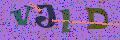
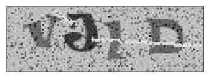
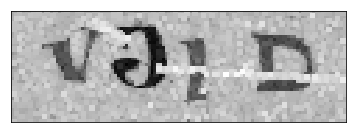
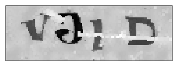
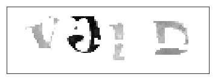
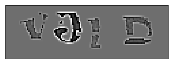

## break captchas

### Introduction
Verification code break scripts based on Python-OpenCV and TensorFlow.
This is an optimized implementation of this project https://github.com/ypwhs/captcha_break,
we preprocessed raw images and get better performance on complicated captchas. 

### Environment Requirements
Please refer to requirements.txt in the root diractory.
For training the model, GPU mode is recommended.

### How to train the model
First, put your training images(RGB format, grayscale image is not supported) in dir ./pic,
then put labels in  ./train_label.csv, the original file is a sample.

Run train_model.sh(Linux and Mac), 
```bash
bash train_model.sh
```
or train_model.bat(windows), 
```
train_model.bat
```
you can change paramenters in these scripts manually.
Trained model will be in dir ./model/, to visualize the model,
you can use Netron(project url: https://github.com/lutzroeder/netron).

### How to use model to inference pics
1. You can run ./inference.py to get inference result
2. If you want to use this model as a tool, you should ./batch_inference.py instead. Put raw images under ./test/ dir , run batch_inference.py to get output csv file. 

### Model performance
The pretrained model has accuracy above 96% on four characters verification code after training 20 epochs. 

### Directory Structure
* ./run.py : python file for training model
* ./inference.py : python file for inferencing
* ./train_model.bat : training script for windows
* ./train_model.sh : training script for Linux and Mac
* ./requirements.txt : list of python environment dependencies
* ./train_label.csv : csv file containing image labels, this one is a sample
* ./utils/ : dir containing utility functions
* ./pic/ : dir containing raw images
* ./save/ : dir containing preprocessed images
* ./test/ : dir containing raw images to inference
* ./model/ : dir containing trained models
* ./sample/ : dir containing images used in README.md

### Image preprocessing method (./utils/util_func.py)
Let's take one image for example.


Input images must be of the same size and RGB format,so firstly we resize them into given height and width. (in this example the size of test image is already the given size, so there's no difference)


After that, convert images from RGB format into grayscale. 


Then, to remove dots in the image, we apply dilation operation on the image.


In order to smooth the background and also keep gradients of symbols' edges, Bilateral Filter performed well.


There's still some lines in the image, in our dataset lines are usually brighter than real letters or numbers, so we choose a specific operation to darken all pixels above the threshold.


After Processing edges are not so clear, so we use a high-pass filter to sharpen the edges, then we get the preprocessed images.

